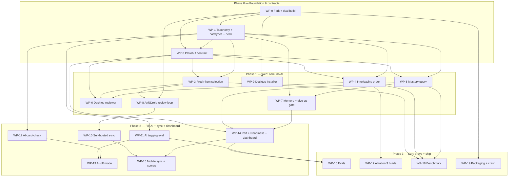

# Speedrun — Build Plan (work packages & phasing)

> The **dispatcher** artifact: the design (PRD + 4 specs + decision log) split into
> **self-contained, parallelizable work packages (WP-0…WP-19)**, grouped into the
> assignment's deadline phases (Wed / Fri / Sun). Each WP states its goal, the
> contract it **owns** or **consumes**, the files it touches, its dependencies, its
> acceptance (linked to a spec/PRD AC + decision), and what it's **parallel-safe
> with**. Companions: [`AGENTS.md`](./AGENTS.md), [`prd-speedrun.md`](./prd-speedrun.md),
> the specs (`spec-engine`, `spec-measurement`, `spec-sync-mobile`, `spec-ai`),
> [`decisions.md`](./decisions.md), [`backlog.md`](./backlog.md).
>
> This is a **living** plan — update WP `Status` in place as work lands (it's not a
> frozen doc). It deliberately holds *no new design decisions*; if building forces
> one, log it in `decisions.md` (next free **D-SR17**) and reference it here.

## How to use this

1. **Freeze the contracts first (Phase 0).** WP-1 (data contract) and WP-2
   (protobuf contract) are *contract producers* — once they land, every other lane
   builds against stable interfaces and can run **in parallel without collisions**.
2. **Pick a lane, not a phase.** Within a phase, the lanes (Engine / Desktop-Reviewer
   / Mobile / Measurement / Sync / AI / Packaging) are independent — hand each lane
   to a different agent/person.
3. **Check the "Touches" line before editing** to avoid two agents in the same file
   (see *Collision zones* below).
4. **Dispatch via the *Dispatch matrix* section** — it gives each WP a parallelism
   class, an isolation strategy (worktree vs offline vs env), and agent-sized
   sub-tasks ready to hand to a Sonnet 4.6 subagent. Rule: any agent that compiles
   Rust or regenerates protobuf runs in its **own `git worktree`**, then merges.

## Status board

| WP | Title | Phase | Lane | Status |
|---|---|---|---|---|
| WP-0 | Fork + dual-platform build spine | 0 | Infra | WP-0a desktop ✅ (B008) · WP-0b mobile pending (B001) |
| WP-1 | Taxonomy + notetypes + seed deck (+weights) | 0 | Content | offline landed ✅ (tests green; real items pending B015) |
| WP-2 | Protobuf interface contract | 0 | Contracts | landed ✅ (proto + stubs; bindings regen in Rust/Py/TS; builds green) |
| WP-3 | Fresh-item selection (`draw_item_for_skill`) | 1 | Engine | not started |
| WP-4 | Interleaving order (`ReviewCardOrder` variant) | 1 | Engine | not started |
| WP-5 | Mastery query (`skill_mastery`) | 1 | Engine | not started |
| WP-6 | Desktop reviewer (commit-then-reveal + draw) | 1 | Desktop-Reviewer | not started |
| WP-7 | Memory score + give-up gate | 1 | Measurement | not started |
| WP-8 | AnkiDroid review loop | 1 | Mobile | not started |
| WP-9 | Desktop installer (clean machine) | 1 | Packaging | not started |
| WP-10 | Self-hosted sync + conflict/offline tests | 2 | Sync | not started |
| WP-11 | AI tagging (anchor eval + baselines) | 2 | AI | offline landed ✅ (stub LLM; real model pending B012/B018) |
| WP-12 | AI-card-check + injection guard | 2 | AI | offline landed ✅ (stub LLM; real model pending B012) |
| WP-13 | AI-off mode wiring | 2 | AI | not started |
| WP-14 | Performance + Readiness + dashboard | 2 | Measurement | not started |
| WP-15 | Mobile two-way sync + scores on phone | 2 | Mobile | not started |
| WP-16 | Proof evals (calibration/paraphrase/leakage) | 3 | Evals | offline harnesses landed ✅ (wiring gaps B013/B014) |
| WP-17 | Interleaving ablation (3 builds) | 3 | Study-feature | not started |
| WP-18 | One-command benchmark + perf targets | 3 | Bench | not started |
| WP-19 | Packaging (APK/TestFlight + installer + crash) | 3 | Packaging | not started |

## Dependency graph

## Parallel lanes (run concurrently within a phase)

| Lane | WPs | Can be owned by |
|---|---|---|
| Infra / Contracts | WP-0, WP-2 | 1 agent (critical path) |
| Content / Data | WP-1 | 1 agent (contract producer) |
| Engine (Rust) | WP-3, WP-4, WP-5 | up to 3 agents (light coordination) |
| Desktop-Reviewer | WP-6 | 1 agent |
| Mobile (AnkiDroid) | WP-8 → WP-15 | 1 agent (start early) |
| Measurement | WP-7 → WP-14 | 1 agent |
| Sync | WP-10 | 1 agent |
| AI | WP-11, WP-12 (→ WP-13) | up to 2 agents |
| Packaging | WP-9, WP-19 | 1 agent |
| Proof | WP-16, WP-17, WP-18 | 1–3 agents |

**Critical path (longest pole):** `WP-0 (AnkiDroid build) → WP-2 → WP-3 → WP-6/WP-8 → WP-10 → WP-15 → WP-19`. Start **WP-0's AnkiDroid sub-track on day 0** — it's the #1 schedule risk ([B001](./backlog.md)).

## Collision zones (coordinate, don't co-edit)

- **WP-3 ↔ WP-4** both live under `rslib/src/scheduler/queue/`. Keep them in *different files*: WP-3 = a new selection module + `scheduler/service`; WP-4 = `builder/{gathering,mod}.rs` ordering. Overlap risk only in `builder/mod.rs` — sequence those edits or split functions.
- **WP-2 blocks all proto consumers.** Land it (even with `todo!()` stubs) before WP-3/4/5/6/14 start, so generated bindings exist.
- **WP-6 ↔ WP-8** share the reviewer *contract* (`draw_item_for_skill` + render-drawn-item, [B002](./backlog.md)) but different codebases (desktop `qt/aqt` + `ts/` vs AnkiDroid) → fully parallel.

---

## Dispatch matrix — parallelism & agent sub-tasks

How to read each WP for parallel execution by **Sonnet 4.6** (`claude-4.6-sonnet-medium-thinking`).

**Parallelism class:** `G` = gate (must finish before dependents) · `P` = fully parallel (isolated) · `C` = parallel **with coordination** (shares files → use a worktree) · `S` = sequential (waits on a named dep).
**Isolation:** `offline` = tools/scripts, no engine build needed (safest for agents) · `worktree` = touches shared Rust/build, run in its own `git worktree` then merge · `in-tree` = small/safe edits · `env/human` = heavy build/sign/mobile → run on your machine.
**Rule:** any agent that compiles Rust or regenerates protobuf runs in an **isolated worktree**; offline-tooling agents can share the tree.

### WP-0 — Fork + dual build
`Class: G · Isolation: env/human · Owner: human (long builds)`
- a) desktop: build from source + prove a trivial Rust change end-to-end
- b) AnkiDroid fork: builds + runs a review loop on a device/emulator (start day 0)

### WP-1 — Taxonomy + notetypes + seed deck
`Class: P (parallel w/ WP-0) · Isolation: in-tree · Model: Sonnet 4.6 (up to 4 agents)`
- a) tag scheme: axis-1 question types, axis-2 sub-skills, trap catalog (as a doc + constants)
- b) the 3 notetypes (fields/templates: Meta, Skill, Item)
- c) cited seed deck: skill notes + suspended tagged item pool (meet per-skill min sizes) + meta cards
- d) exam-frequency weights + cited raw→scaled conversion table

### WP-2 — Protobuf contract
`Class: G (blocks WP-3/4/5/6/14) · Isolation: worktree · Model: Sonnet 4.6 (1 agent, atomic)`
- a) add messages + RPCs (`DrawItemForSkill`, `SkillMastery`) + `ReviewCardOrder` variant
- b) full build → regenerate Rust/Py/TS bindings
- c) stub Rust impls (`todo!()`) so the tree compiles

### WP-3 — Fresh-item selection
`Class: C (coordinate w/ WP-4) · Isolation: worktree · Model: Sonnet 4.6`
- a) selection algorithm + `SchedulerService` impl
- b) best-effort local served-item sidecar (outside collection)
- c) pylib wrapper · d) Rust unit tests (fresh vs least-recently-served)

### WP-4 — Interleaving order
`Class: C (coordinate w/ WP-3) · Isolation: worktree · Model: Sonnet 4.6 (2 agents: rust ‖ ui)`
- a) `ReviewCardOrder` variant in `builder/{gathering,mod}.rs` (round-robin, no consecutive same-type)
- b) deck-options toggle (ts/qt) — separable to a 2nd agent
- c) Rust unit test (ordering)

### WP-5 — Mastery query
`Class: P (isolated crate) · Isolation: worktree · Model: Sonnet 4.6`
- a) indexed SQL aggregate + `StatsService` impl · b) pylib wrapper · c) unit test + p95<1s check

### WP-6 — Desktop reviewer
`Class: P (own codebase) · Isolation: worktree · Model: Sonnet 4.6 (2 agents: L1 ‖ L2)`
- a) Level-1 commit-then-reveal over item-cards (`ts/reviewer/` + `qt/aqt/reviewer.py`)
- b) Level-2: call `draw_item_for_skill` + render drawn item via `RenderUncommittedCard`, answer skill card
- c) trap + per-choice why-wrong reveal UI

### WP-7 — Memory + give-up gate
`Class: P (new module) · Isolation: worktree · Model: Sonnet 4.6 (2 agents)`
- a) `readiness_gate` pure fn + unit tests (`(199,0.49)→Abstain`, `(200,0.50)→Eligible`)
- b) Memory score (mean FSRS recall + bootstrap band) + pylib exposure

### WP-8 — AnkiDroid review loop
`Class: S (on WP-0,WP-3) · Isolation: env/human · Owner: human + Sonnet 4.6 assist`
- a) load deck + review loop on shared engine · b) port commit-then-reveal/draw to AnkiDroid UI

### WP-9 — Desktop installer
`Class: P · Isolation: env · Owner: human/CI`
- a) build clean-machine installer (qt/installer)

### WP-10 — Self-hosted sync + tests
`Class: S (on WP-8) · Isolation: env · Model: Sonnet 4.6 (harness) + human (run)`
- a) one-command `anki-sync-server` bring-up + docs · b) 7b sync-test harness (10+10, conflict, offline-merge)

### WP-11 — AI tagging (anchor eval)
`Class: P · Isolation: offline · Model: Sonnet 4.6 (up to 4 agents)`
- a) tagging pipeline (axis-1 rules + AI axis-2/trap) · b) keyword baseline · c) vector-kNN baseline
- d) held-out eval harness + side-by-side report · e) tag-apply + human-verify queue

### WP-12 — AI-card-check + injection guard
`Class: P · Isolation: offline · Model: Sonnet 4.6 (up to 4 agents)`
- a) meta-vocab generator (cited source) · b) generate-then-verify checker · c) 50-item gold set
- d) injection sanitizer + planted-injection fixture · e) three-count report + cutoff gate

### WP-13 — AI-off mode
`Class: S (on WP-11,WP-12) · Isolation: in-tree · Model: Sonnet 4.6`
- a) global AI-off flag · b) fallbacks (stem-rule tags, keyed explanations) · c) assert scores compute AI-off

### WP-14 — Performance + Readiness + dashboard
`Class: S (on WP-5,WP-7) · Isolation: worktree+ts · Model: Sonnet 4.6 (2 agents: rust ‖ ts)`
- a) Performance (Wilson per skill) · b) Readiness mapping (perf-weighted coverage → conversion + band + confidence + next-best)
- c) dashboard route (3 cards + abstain panel) in `ts/routes/`

### WP-15 — Mobile sync + scores
`Class: S (on WP-10,WP-14) · Isolation: env/human · Owner: human + Sonnet 4.6 assist`
- a) AnkiDroid two-way sync · b) three scores + abstain panel on mobile

### WP-16 — Proof evals
`Class: P · Isolation: offline · Model: Sonnet 4.6 (3 agents)`
- a) calibration (Brier/log-loss + chart) · b) paraphrase gap (30×2) · c) leakage scan (hash + embedding)

### WP-17 — Interleaving ablation
`Class: S (on WP-4,WP-14) · Isolation: worktree · Model: Sonnet 4.6`
- a) 3 build variants (full / interleave-off / plain Anki) · b) ablation harness (same items/time, pre-stated metric, report range+nulls)

### WP-18 — Benchmark
`Class: S (on WP-3/4/5) · Isolation: offline+build · Model: Sonnet 4.6`
- a) `make bench` over the 50k deck → p50/p95/worst per action vs §7 targets

### WP-19 — Packaging + crash test
`Class: S (on all) · Isolation: env/human · Owner: human/CI`
- a) signed APK / TestFlight + desktop installer · b) crash test (20× kill) → zero corruption · c) AI-off run verification

---

# Phase 0 — Foundation & contracts

### WP-0 — Fork + dual-platform build spine
- **Lane:** Infra · **Depends on:** — · **Status:** not started
- **Goal:** Fork Anki (AGPL, credit upstream). Build desktop from source (`just run`) and prove a *trivial* Rust change shows end-to-end. Get the **AnkiDroid fork building** with the shared Rust backend and running a review loop on a device/emulator.
- **Contract (owns):** the buildable repo + a green "trivial Rust change visible" sanity path on both platforms.
- **Touches:** repo root, build tooling; AnkiDroid fork repo.
- **Deliverable:** both apps build & run; commit hash + clean-build recording.
- **Acceptance:** PRD Wednesday "forked & building"; spec-sync-mobile §9. Risk: [B001].
- **Parallel-safe with:** WP-1 (once forked). *Two sub-tracks: desktop-build ‖ AnkiDroid-build.*

### WP-1 — Taxonomy + notetypes + seed deck (+ weights/conversion)
- **Lane:** Content · **Depends on:** WP-0 (repo) · **Status:** not started
- **Goal:** Encode the PowerScore taxonomy as the **tag scheme** (axis-1 question types, axis-2 sub-skills, trap catalog — D-SR13). Define the 3 notetypes **LSAT Meta / LSAT Skill / LSAT Item** (fields per spec-engine §7). Build a **cited seed deck**: skill notes (1 per skill/trap), a tagged + suspended item pool meeting per-skill min sizes ([B007]), meta cards. Compile the **exam-frequency weights** + a cited **raw→scaled conversion table** for Readiness.
- **Contract (owns):** the data contract every lane codes against (tag names, notetype field order, deck layout, weights). Document it in a short header in the deck/import or a `data-contract` note.
- **Touches:** content/import files; no engine code.
- **Acceptance:** spec-engine §7/§9/§10; spec-measurement §4.3/§5; D-SR11, D-SR13.
- **Parallel-safe with:** everything (pure data + doc). *Highest-leverage to finish early.*

### WP-2 — Protobuf interface contract
- **Lane:** Contracts · **Depends on:** WP-0; peek at WP-1 (skill-id shape) · **Status:** not started
- **Goal:** Add `DrawItemForSkill` + `SkillMastery` (messages + RPCs) and the `ReviewCardOrder` **enum variant** to proto; run a **full build** so Rust traits, `_backend_generated.py`, and `backend.ts` regenerate. Land **stub impls** (`todo!()`/`unimplemented`) so everything compiles.
- **Contract (owns):** the cross-language API surface (freezes interfaces for parallel work).
- **Touches:** `proto/anki/scheduler.proto`, `proto/anki/stats.proto`, `proto/anki/deck_config.proto`.
- **Acceptance:** spec-engine §5.5; generated bindings present in all 3 languages.
- **Parallel-safe with:** —(gate). Unblocks WP-3/4/5/6/14.

---

# Phase 1 — Wednesday: core review loop, both apps, NO AI

### WP-3 — Fresh-item selection (`draw_item_for_skill`)
- **Lane:** Engine · **Depends on:** WP-2, WP-1 · **Status:** not started
- **Goal:** Implement the selection algorithm (spec-engine §5.2) + `SchedulerService` impl + pylib wrapper + the **best-effort local served-item sidecar** (outside the collection — D-SR4).
- **Touches:** `rslib/src/scheduler/service/`, a new `rslib/src/scheduler/queue/selection.rs`, `pylib/anki/scheduler/v3.py`.
- **Acceptance:** spec-engine AC 3; ≥1 Rust unit test (fresh vs least-recently-served fallback).
- **Parallel-safe with:** WP-4, WP-5, WP-7.

### WP-4 — Interleaving order (`ReviewCardOrder` variant)
- **Lane:** Engine · **Depends on:** WP-2, WP-1 · **Status:** not started
- **Goal:** Implement the new enum variant in the queue builder (round-robin across types; stock order = control) + expose the deck-options toggle.
- **Touches:** `rslib/src/scheduler/queue/builder/{gathering,mod}.rs`; deck-options UI (`ts/routes/deck-options/`, `qt/aqt/deckoptions.py`).
- **Acceptance:** spec-engine AC 1; Rust unit test (no consecutive same-type); D-SR6.
- **Parallel-safe with:** WP-3 (see collision note), WP-5.

### WP-5 — Mastery query (`skill_mastery`)
- **Lane:** Engine · **Depends on:** WP-2, WP-1 · **Status:** not started
- **Goal:** One indexed SQL aggregate per skill (mastered / total / avg recall) + `StatsService` impl + pylib wrapper; p95 < 1s on 50k.
- **Touches:** `rslib/src/stats/service.rs`, `rslib/src/storage/` (SQL), `pylib/anki/collection.py`.
- **Acceptance:** spec-engine AC 4; Rust unit test (aggregate correctness); D-SR5.
- **Parallel-safe with:** WP-3, WP-4.

### WP-6 — Desktop reviewer: commit-then-reveal + drawn-item render
- **Lane:** Desktop-Reviewer · **Depends on:** WP-1; WP-3 (for Level 2); WP-4 (interleave) · **Status:** not started
- **Goal:** **Level 1** first (commit-then-reveal over real item-cards, interleaved), then **Level 2** (skill card + `draw_item_for_skill` + render drawn item via `RenderUncommittedCard`, answer the skill card). Reveal key + per-choice why-wrong + trap.
- **Touches:** `qt/aqt/reviewer.py`, `ts/reviewer/`.
- **Acceptance:** spec-engine AC 1/2/§6; PRD AC 9.A; risk [B002].
- **Parallel-safe with:** WP-8 (mobile), Measurement.

### WP-7 — Memory score + give-up gate
- **Lane:** Measurement · **Depends on:** WP-1; WP-5 (inputs) · **Status:** not started
- **Goal:** Memory score (mean FSRS recall over meta cards + bootstrap band) + the **pure-function `readiness_gate`** in Rust with unit tests. (Performance/Readiness full impl is WP-14.)
- **Touches:** new `rslib/src/` measurement module (or `stats/`), `pylib`.
- **Acceptance:** spec-measurement AC 1 (Memory), AC 2 (gate `(199,0.49)→Abstain`, `(200,0.50)→Eligible`); PRD AC 9.C(13); D-SR10.
- **Parallel-safe with:** reviewer, mobile, engine.

### WP-8 — AnkiDroid review loop
- **Lane:** Mobile · **Depends on:** WP-0 (Android build), WP-1; WP-3 (Level 2) · **Status:** not started
- **Goal:** Load the exam deck and run a real review session on the shared engine; port commit-then-reveal + drawn-item to AnkiDroid's review UI. (Wednesday: same-deck review; two-way sync not yet.)
- **Touches:** AnkiDroid fork review UI.
- **Acceptance:** spec-sync-mobile §7 (review loop); PRD Wednesday mobile.
- **Parallel-safe with:** WP-6.

### WP-9 — Desktop installer (clean machine)
- **Lane:** Packaging · **Depends on:** WP-0 · **Status:** not started
- **Goal:** Produce a desktop installer that runs on a clean machine (Anki's `qt/installer` tooling).
- **Acceptance:** PRD §9.F; Wednesday "clean-machine install" proof.
- **Parallel-safe with:** all (packaging lane).

---

# Phase 2 — Friday: AI + two-way sync + full dashboard

### WP-10 — Self-hosted sync + conflict/offline tests
- **Lane:** Sync · **Depends on:** WP-0, WP-8 · **Status:** not started
- **Goal:** One-command bring-up of `anki-sync-server`; point both apps at it; run the **7b sync test** (10+10, none lost/double) and the same-card **conflict** + **offline-then-merge** cases.
- **Touches:** deployment config/docs; uses `rslib/sync` as-is.
- **Acceptance:** spec-sync-mobile AC 1–3,5; PRD AC 9.B; D-SR8.
- **Parallel-safe with:** AI lane, Measurement-UI.

### WP-11 — AI tagging (anchor eval + baselines)  *(the evaluated feature)*
- **Lane:** AI · **Depends on:** WP-1 (gold labels/taxonomy) · **Status:** not started
- **Goal:** AI tagging pipeline (axis-1/2/trap) + human-verify step; **held-out eval** (accuracy/macro-F1 vs gold) + **keyword** and **vector-kNN** baselines; side-by-side report; apply verified tags to items.
- **Touches:** new `tools/ai/tagging/` (offline scripts); tag application.
- **Acceptance:** spec-ai AC 2; PRD AC 9.E(17); D-SR14. Risk: [B006].
- **Parallel-safe with:** WP-12, Sync.

### WP-12 — AI-card-check + injection guard
- **Lane:** AI · **Depends on:** WP-1 (meta notetype), a cited source + gold set · **Status:** not started
- **Goal:** Generate meta-vocab cards from a cited source; checker vs **50-item gold set**; pre-set cutoff (0 wrong-fact tolerance); report the three counts; block fails; **source sanitizer** + planted-injection fixture.
- **Touches:** new `tools/ai/cardcheck/`.
- **Acceptance:** spec-ai AC 3; PRD AC 9.E(18); D-SR15.
- **Parallel-safe with:** WP-11.

### WP-13 — AI-off mode wiring
- **Lane:** AI · **Depends on:** WP-11, WP-12 · **Status:** not started
- **Goal:** A single flag that disables all model calls; fallbacks (stem-rule tags, keyed explanations); confirm all three scores compute with AI off; Wednesday build is AI-off by default.
- **Touches:** config + the AI call sites.
- **Acceptance:** spec-ai AC 4; PRD AC 9.E(19), 9.F(22).
- **Parallel-safe with:** Sync, Measurement-UI.

### WP-14 — Performance + Readiness + dashboard
- **Lane:** Measurement · **Depends on:** WP-5, WP-7, WP-1 (weights/conversion) · **Status:** not started
- **Goal:** Performance (Wilson per skill from skill revlog) + Readiness (perf-weighted coverage → conversion + band + confidence + next-best-thing) + coverage; the **dashboard** (3 cards + abstain panel) in `ts/routes/`.
- **Touches:** `rslib/src/` measurement, `ts/routes/` (new dashboard route).
- **Acceptance:** spec-measurement AC 1,3,4; PRD AC 9.C; D-SR2, D-SR9.
- **Parallel-safe with:** Sync, AI.

### WP-15 — Mobile two-way sync + scores on phone
- **Lane:** Mobile · **Depends on:** WP-10, WP-14, WP-8 · **Status:** not started
- **Goal:** AnkiDroid two-way sync working; render the three scores + abstain panel on mobile (same gate/rules).
- **Touches:** AnkiDroid fork (sync UI + dashboard).
- **Acceptance:** spec-sync-mobile AC 1–2,7; PRD AC 9.B/9.C on phone.
- **Parallel-safe with:** —(late Phase 2).

---

# Phase 3 — Sunday: prove + ship

### WP-16 — Proof evals (calibration / paraphrase / leakage)
- **Lane:** Evals · **Depends on:** WP-7, WP-11, WP-14 · **Status:** not started
- **Goal:** Calibration chart + Brier/log-loss on held-out reviews; paraphrase gap (30×2); leakage scan (hash + embedding) — all scripted, seeded, held-out.
- **Touches:** `tools/eval/`.
- **Acceptance:** spec-measurement AC 3 + §7; PRD AC 9.G.
- **Parallel-safe with:** WP-17, WP-18.

### WP-17 — Interleaving ablation (3 builds)
- **Lane:** Study-feature · **Depends on:** WP-4, WP-14 · **Status:** not started
- **Goal:** Full / interleaving-off / plain-Anki builds; same items/learners/time budget; **pre-stated metric** (delayed mixed-type accuracy); report effect size + range + **null results**.
- **Touches:** build configs + `tools/eval/ablation/`.
- **Acceptance:** PRD AC 9.D; D-SR6.
- **Parallel-safe with:** WP-16, WP-18.

### WP-18 — One-command benchmark + perf targets
- **Lane:** Bench · **Depends on:** WP-3, WP-4, WP-5, WP-1 (50k deck) · **Status:** not started
- **Goal:** `make bench` loads the 50k deck and prints p50/p95/worst for each action; verify §7 targets (button <50ms, next card <100ms, dashboard <1s, refresh <500ms, sync <5s, cold start <5s/<4s).
- **Touches:** `tools/bench/`.
- **Acceptance:** PRD §7, AC 9.F(20).
- **Parallel-safe with:** WP-16, WP-17.

### WP-19 — Packaging (APK/TestFlight + installer + crash test)
- **Lane:** Packaging · **Depends on:** WP-0 + all feature WPs · **Status:** not started
- **Goal:** Packaged phone build (signed APK or TestFlight) + desktop installer; **crash test** (20× kill mid-review) on both → zero corruption; confirm both run with **AI off**.
- **Touches:** `qt/installer`, AnkiDroid release config, `tools/crash/`.
- **Acceptance:** PRD AC 9.F(21), 9.B; assignment Sunday handin.
- **Parallel-safe with:** evals/bench (different lane).

---

Created as the Speedrun dispatch/build plan · maintained with the `iris-log` skill by Iris Cai.
