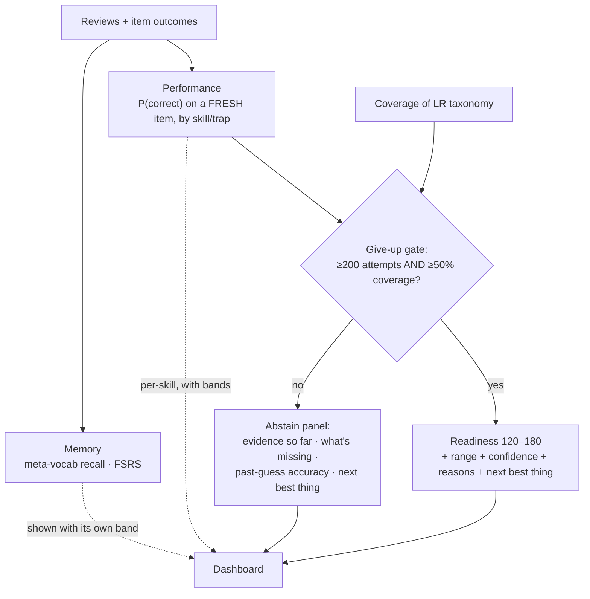
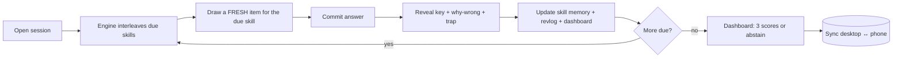

# Speedrun — Product Requirements Document

> **Speedrun** is an LSAT study app forked from Anki: one shared Rust engine, a
> desktop app and an Android companion that sync, and three *separately reported*
> scores — Memory, Performance, Readiness — each with an honest uncertainty range
> and a rule for when it refuses to guess. It trains *reasoning*, not recall, by
> scheduling the **skill/trap** rather than the literal flashcard. For college
> students preparing for the post-2024 LSAT. This document is the user-facing
> contract; mechanism lives in the specs.
>
> **Authority:** frozen initial plan, written before implementation. For current
> truth read the decision log [`decisions.md`](./decisions.md) (and any "Overrides
> since the plan" notes); where a later decision conflicts with this doc, the
> decision wins.
>
> Companions: [`decisions.md`](./decisions.md) · the specs ([`engine`](./spec-engine.md),
> [`measurement`](./spec-measurement.md), [`sync-mobile`](./spec-sync-mobile.md), [`ai`](./spec-ai.md)) ·
> brainlift [`../lsat-speedrun-brainlift.md`](../lsat-speedrun-brainlift.md) ·
> engine map [`../../extra/architecture/ANKI_ARCHITECTURE.md`](../../extra/architecture/ANKI_ARCHITECTURE.md).

---

## 1. Overview

- **Name:** *Speedrun* — the goal is a faster, honestly-measured path to a target LSAT score.
- **Persona:** **Maya**, a 21-year-old humanities undergrad prepping for the LSAT around classes. She studies at a desk most evenings and on her phone in the gaps between lectures. She's motivated but anxious, and she's been burned by tools that show a confident "you're 78% ready" with nothing behind it.
- **Exam:** LSAT, post-2024 format (2 scored LR + 1 RC, no Logic Games, **120–180**). [D-SR1]
- **Platform / stack:** a fork of **Anki** — core logic in the **Rust** engine (`rslib`), desktop via **PyQt** (`qt/aqt`), Android via an **AnkiDroid** fork, all sharing the engine; progress syncs through a **self-hosted `anki-sync-server`**. [D-SR7, D-SR8]
- **License:** AGPL-3.0-or-later, with credit to Anki (some Anki components are BSD-3-Clause).

## 2. Concept & audience

- **One-sentence pitch:** An Anki-powered LSAT trainer that spaces the *skill and the trap* (not the literal item), serves a fresh question each review, and reports Memory, Performance, and Readiness as three separate, honestly-bounded numbers — refusing to project a score until it has the evidence.
- **The core loop:** open a session → the engine interleaves due **skills** → for each, it draws a **fresh, unseen** item → you commit an answer, then reveal the key, the per-choice "why wrong," and the trap → your review updates the skill's memory state and your dashboard.
- **The status-quo problem:** Plain Anki trains "the answer is C" — recall of a specific item, which is *performance, not learning*, and the wrong primitive for a reasoning test (Insight 2). Commercial LSAT tools show blended "readiness %" with no evidence, no range, and no honesty about coverage.
- **Emotional payoff:** Maya trusts the number. When the app says "503–512, low confidence, you've covered 42% of LR," she knows *exactly* what it's based on and what to do next — and when it says "not enough data yet," she trusts that too.
- **Differentiators:**
  - vs **plain Anki:** schedules skills/traps and interleaves; reasoning practice, not flashcards (Insight 2, D2).
  - vs **7Sage / LSAT Demon / Blueprint:** three *separated* honest scores with ranges and a *refuse-to-guess* rule; the gap between recall and performance is measured and shown, not hidden.
  - vs **a generic AI tutor:** AI never owns correctness — every item has an official key; AI only tags, phrases, and diagnoses, and every AI feature must beat a simpler baseline (D1, D-SR14).
- **The spiky stance** (from the brainlift): the LSAT is ~66% Logical Reasoning and self-contained — so we build **LR first**, train *reading* (not RC drilling) as a fluency substrate, and treat the only flashcard-appropriate layer as the logic *meta-vocabulary*, not content.

## 3. The honesty contract (the heart of the product)

Speedrun reports **three separate scores** — never one blended number — and each carries its full evidence. A score is shown **only** alongside: the point estimate, the **likely range**, the **% of the exam covered so far**, a **confidence** indicator, the **last-updated** time, the **main reasons** behind it, and the **rule for when it abstains**.

- **Memory** — automaticity of the declarative meta-layer (logic/argument vocabulary, named-flaw catalog, indicator/quantifier words). FSRS recall probability with a band. [D-SR2]
- **Performance** — P(correct) on a **fresh, unseen** item of a given question-type × reasoning-sub-skill × trap, estimated from history on *other* items of that skill, per-skill with bands. This is the **bridge** memory alone can't cross. [D-SR2]
- **Readiness** — projected **120–180** with a range and a confidence gated by **coverage**, plus the **single best next thing to study**. Method: performance-weighted coverage → published raw→scaled conversion; the band widens as data/coverage shrink. [D-SR9]
- **The give-up rule** — no Readiness projection until **≥200 graded attempts AND ≥50% LR-taxonomy coverage**; otherwise the **abstain panel** shows what exists, what's missing, how accurate past guesses were, and what to do next. Memory and per-skill Performance still render where they have data. [D-SR10]

> A confident number without its evidence is an automatic fail by the assignment's
> rules, and dishonest by ours. The abstain state is a first-class feature, not an
> error state.

## 4. UX walkthrough (a session)

1. **Maya opens the desktop app** to her LSAT deck. The home screen shows her three scores at a glance: *Memory 0.71 (±0.06)*, *Performance — by skill*, and a **Readiness** card currently reading **"Not enough data to project a score yet — 142/200 attempts, 38% coverage."**
2. **She starts a review session.** The engine **interleaves** due *skills* — an Assumption item, then a Flaw item, then a Strengthen item — never blocking on one type. For each due skill it **draws a fresh item she hasn't seen**.
3. **She reads the stimulus, prephrases, and commits an answer** before anything is revealed (commit-then-reveal). Only then does the app show the **key**, a **per-choice "why wrong,"** and the **trap tag** for any distractor she fell for.
4. **Her grade flows into the engine:** the *skill's* memory state updates (FSRS), the revlog records the review, and the dashboard recomputes. Because the item was fresh, this counts as **Performance** evidence, not just Memory.
5. **Between classes, Maya reviews on her phone** offline. The Android app runs the **same engine** on the **same deck** and follows the **same three-score + give-up rules**.
6. **On the train home she reconnects;** her phone reviews and her earlier desktop reviews **merge** with none lost or double-counted.
7. **Two weeks in,** she crosses the threshold. Readiness flips on: **"504, likely 499–510, low confidence (51% LR coverage). Biggest lever: Parallel Reasoning."** She trusts it because every part of it is shown.
8. **A daily-reading card** appears: a domain-rotating passage → she produces a short structural map → harvests two unfamiliar terms into her vocab deck (the fluency substrate beneath RC/LR).

## 5. UI direction

- **Feel:** minimal extraneous load (Sweller/CLT) — a clean, distraction-light review surface so working memory goes to the *reasoning*, not the chrome. Accuracy-first: surface the timed-vs-untimed gap rather than a ticking clock ("sticky note over the clock").
- **The dashboard** makes *separation* visceral: three distinct cards, each with its own band and "why," never a single blended gauge. The abstain state is designed to feel trustworthy, not broken.
- **Reuses** Anki's theming (light/night) and web-view UI stack; new screens (dashboard, commit-then-reveal review, abstain panel) are built as Svelte pages where practical.
- **Not in this phase:** a bespoke design system, animations, or a marketing site.

## 6. Strategy & philosophy

- **LR-first**, because it's ~66% of the score, breaks cleanly into taggable SRS units, and has the clearest expert method; **RC is a phase-2 extension** of the same engine; **daily reading** is the fluency substrate beneath both (a stub in v1). [D-SR12]
- **Schedule the skill/trap, not the item** (D2): serve a fresh item each review → interleaving for free → trains the *diagnosis* step a reasoning test rewards. [D-SR3]
- **The bridge is the product:** Memory → Performance → Readiness are built and shown as *separate* steps; the gap between them is measured (paraphrase test) and never hidden. [D-SR2]
- **AI augments, never authors or judges:** correctness is always a keyed lookup; AI tags, phrases, and diagnoses, and must beat a baseline. [D-SR14]

## 7. Performance / quality targets

Measured on the shared 50,000-card deck and reference machines; report p50, p95, and worst-case.

| Action | Target (p95) |
|---|---|
| Button press acknowledged (desktop & phone) | < 50 ms |
| Next card after grading | < 100 ms |
| Dashboard first load | < 1 s |
| Dashboard refresh (non-blocking) | < 500 ms |
| Sync of a normal session | < 5 s on a normal connection |
| App cold start | < 5 s desktop / < 4 s phone |
| Any UI freeze | never > 100 ms |
| Memory use on 50k cards | under a stated limit (desktop & mid-range phone) |
| Crash test | **zero** corrupted collections, both platforms |

A one-command **benchmark** (`make bench` or equivalent) loads the 50k-card deck and prints p50/p95/worst for each action. [→ spec-engine, spec-sync-mobile]

## 8. Out of scope (this phase)

- **Reading Comprehension question practice** and the **full** daily-reading module — phase-2, same engine. [D-SR12]
- **iOS** companion — Android-first; iOS via FFI is later. [D-SR7]
- A **synced per-item-outcome table** — v1 recomputes Performance per device from the synced revlog. [D-SR4]
- The **full AI feature roster** (explanation, difficulty, RAG/graph) beyond the committed anchor (tagging) — open/in flux; each must clear the contract before shipping. [D-SR14]
- **Item-redistribution licensing** — deferred to ops; not a code concern this build. [D-SR11]
- **End-to-end Readiness validation** against real practice-test outcomes — not feasible in a week; Readiness is validated at the calibrated-steps level (Step 1–3). [D-SR1, D-SR9]

## 9. Acceptance criteria

> Each bucket ships when **all** of the following are observable in the deployed apps.

### 9.A — Brownfield engine (the Rust change)
1. The engine schedules a **skill/trap unit** and, on a due review, **draws a fresh, unseen item** of that skill and renders it (commit-then-reveal). A config flag toggles the interleaving/fresh-item behavior.
2. Reviews flow through Anki's normal answer path: **FSRS interval math is unchanged**, the **revlog** records each review, and **undo** restores the prior state atomically — with **no new collection table and no schema-version change** (per-card metadata rides the existing `custom_data`/tags; repeat-avoidance is a best-effort local sidecar).
3. A **mastery-query** backend call returns per-skill mastered-count + average recall fast enough to meet the dashboard target on 50k cards.
4. The change ships to **both** desktop and the Android build via the shared engine.
5. **Tests:** ≥3 Rust unit tests for the new selection/gate/outcome logic + ≥1 test that calls the change **from Python**; a test proving **undo** works and the collection does not corrupt; a one-page note on *why this belongs in Rust*; and a list of upstream files touched with a merge-difficulty assessment.
- **9.A-neg (scope):** No change to FSRS interval formulas; **no schema-version change** and no new synced table in v1; the engine never authors items.
- → Spec: `spec-engine`. Decisions: D-SR3, D-SR4, D-SR5, D-SR6.

### 9.B — Two apps, one engine, working sync
6. Desktop and Android run the **same engine** on the **same deck** and run real review sessions.
7. **Two-way sync:** a card reviewed on the phone appears on the desktop after sync, and vice-versa, with **none lost or double-counted**.
8. **Offline then reconnect:** review while offline; on reconnect, reviews merge.
9. **Conflict:** the same card reviewed offline on both devices merges to a documented, deterministic result (Anki USN/graves merge); the rule is written down.
- **9.B-neg:** No silent review loss or double-count; no dependence on AnkiWeb's hosted servers (self-hosted).
- → Spec: `spec-sync-mobile`. Decisions: D-SR7, D-SR8.

### 9.C — Three scores + honesty/give-up
10. The dashboard shows **Memory, Performance, Readiness as three separate values**, each with a **range**, **last-updated** time, and its **main reasons**.
11. **Readiness** shows the point estimate, band, **% coverage**, and **confidence**, plus the **single best next thing to study**.
12. Below threshold, Readiness **abstains** with the honest panel (evidence so far, what's missing, past-guess accuracy once available, next best thing) and shows **no point estimate**.
13. The give-up gate is a **pure function** with a unit test (199/49% → abstain with reasons; 200/50% → eligible) and an integration test asserting the dashboard payload contains **no Readiness point estimate** while abstaining.
- **9.C-neg:** Never a single blended "% ready"; never a Readiness number without its evidence; never a number below threshold.
- → Spec: `spec-measurement`. Decisions: D-SR2, D-SR9, D-SR10.

### 9.D — Study feature ablation (interleaving)
14. Three runnable builds exist: **full** (interleaving on), **feature-off** (interleaving off), and **plain unmodified Anki**.
15. A reproducible experiment compares them on the **same items, same learners, same time budget**, with the **main metric stated in advance** (accuracy on new mixed-type items), reporting a **range** and **null results** honestly.
- **9.D-neg:** No "feels better" claims; the comparison is re-runnable by someone else.
- → Spec: `spec-engine`, `spec-measurement`. Decisions: D-SR6.

### 9.E — AI features + the honesty contract
16. Every shipped AI output **traces to a named source** and is produced **generate-then-verify** (AI never decides correctness).
17. The **anchor evaluated feature** (skill/trap/type tagging) has a **held-out eval** (accuracy vs human gold labels) and a **side-by-side** showing it **beats** keyword and vector baselines.
18. The **AI-card-check**: generate meta-vocab cards from a cited source, run them through the checker against a **50-item gold set** with a **pre-set pass cutoff**, report the three counts (correct&useful / wrong / correct-but-bad-teaching), and **block** failing cards; the source is **sanitized for hidden text** first.
19. **The app still produces all three scores with AI switched off.**
- **9.E-neg:** No AI in the Wednesday build; no AI output without a traceable source; no AI authoring of LR items; no AI as final judge of correctness.
- → Spec: `spec-ai`. Decisions: D-SR14, D-SR15.

### 9.F — Reliability, performance, crash/offline
20. All p95 targets in §7 are met and reported (p50/p95/worst) via the one-command benchmark.
21. **Crash test:** each app killed mid-review 20× → **zero** corrupted collections.
22. **Offline:** AI features turn off cleanly with no connection; both apps keep working and still give scores.
- **9.F-neg:** Nothing freezes the UI > 100 ms; no corruption under the crash test.
- → Spec: `spec-engine`, `spec-sync-mobile`. Decisions: D-SR4, D-SR8.

### 9.G — Reproducible evals (the proof)
23. **Memory calibration:** a calibration chart + a score (Brier or log-loss) on **held-out** reviews.
24. **Performance:** accuracy on **held-out** exam-style items, by skill.
25. **Paraphrase test:** for 30 items, compare recall vs accuracy on 2 reworded versions each; **report the gap** (proving Performance ≠ Memory copy).
26. **Leakage check:** a script flags any test item (or near-copy) in training data; shown clean.
27. **Score mapping** is written down with its range; everything is **re-runnable** by a third party for the same result.
- **9.G-neg:** No score from leaked data; no held-out-free claims; no un-runnable results.
- → Spec: `spec-measurement`, `spec-ai`. Decisions: D-SR2, D-SR9.

## 10. Cross-cutting edge cases

> The "we will try to break it" list (assignment §10), each mapped to the AC that resolves it.

| # | Edge case | Resolved by |
|---|---|---|
| 1 | Student memorizes card wording but fails reworded questions | AC 25 (paraphrase gap); D-SR2 (Performance on fresh items) |
| 2 | Huge deck that skips a high-weight topic | AC 11–12 (coverage shown; abstain if below line); D-SR10 |
| 3 | Two cards stating opposite facts | AC 16–18 (key-grounded, generate-then-verify; bad cards blocked) |
| 4 | Source with hidden text (prompt injection) | AC 18 (sanitize source before generation) |
| 5 | Student taps "Good" without reading | D-SR3 commit-then-reveal + timed-vs-untimed gap surfaced (spec-measurement) |
| 6 | Topic with almost no history | AC 12 (abstain / wide bands); D-SR9 (band widens) |
| 7 | Accurate but too slow for the time limit | timed-vs-untimed gap in the dashboard (spec-measurement) |
| 8 | AI cards correct but useless | AC 18 (the "correct-but-bad-teaching" count + cutoff) |
| 9 | Score jumps because test items leaked into training | AC 26 (leakage check) |
| 10 | AI offline / rate-limited / broken output | AC 19, 22 (works with AI off; clean degradation) |
| 11 | Same card reviewed on two devices offline, then synced | AC 9 (documented conflict rule); D-SR8 |
| 12 | Phone offline mid-sync, or wrong clock | AC 8–9 (offline-then-merge); spec-sync-mobile |
| 13 | Crash mid-review | AC 21 (zero corruption) |
| 14 | Corrupt deck / 50k deck / broken images | AC 20–21 (benchmark + crash test on the 50k deck) |

## 11. Companion documents

| Doc | Owns | Status |
|---|---|---|
| [`decisions.md`](./decisions.md) | Every design decision (D-SR1…16), current truth | living |
| [`spec-engine.md`](./spec-engine.md) | Skill-as-card interleaving/fresh-item engine, mastery query, data model, Rust change, interleaving ablation engine | design locked |
| [`spec-measurement.md`](./spec-measurement.md) | Memory/Performance/Readiness models, calibration, give-up gate, coverage, paraphrase/leakage tests | design locked |
| [`spec-sync-mobile.md`](./spec-sync-mobile.md) | Self-hosted sync, conflict rule, AnkiDroid companion, offline/crash | design locked |
| [`spec-ai.md`](./spec-ai.md) | AI honesty contract, anchor tagging eval + baselines, AI-card-check, injection guard | design locked |
| [`../lsat-speedrun-brainlift.md`](../lsat-speedrun-brainlift.md) | Research grounding (pedagogy, psychometrics, AI) | reference |
| [`../../extra/architecture/ANKI_ARCHITECTURE.md`](../../extra/architecture/ANKI_ARCHITECTURE.md) | How the Anki engine works | reference |

---

Created with the `iris-plan` skill by Iris Cai · maintained with `iris-log`.
