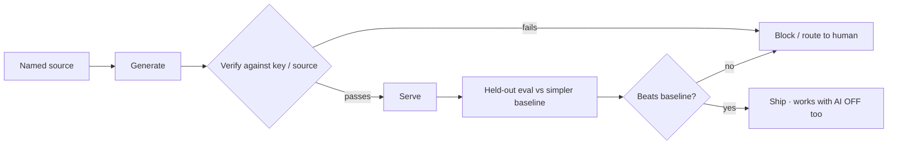

# Spec: AI — the honesty contract, the anchor eval, and the card-check

> What every AI feature must obey, the one feature we commit to evaluating
> (skill/trap tagging vs keyword/vector), the meta-vocab card-check (7f), and the
> prompt-injection guard — all under "AI never owns correctness" (D1). The feature
> roster is deliberately **open**; the *contract* is not. Companions:
> [`prd-speedrun.md`](./prd-speedrun.md) §9.E, [`spec-engine.md`](./spec-engine.md)
> (tags drive selection), [`spec-measurement.md`](./spec-measurement.md) (tags drive
> coverage), [`decisions.md`](./decisions.md) (D-SR14, D-SR15). **Status:** contract
> + anchor locked; roster open.
>
> **Authority:** frozen initial design. For current truth read [`decisions.md`](./decisions.md);
> a later decision overrides this doc where they conflict.

## 1. The problem this fills

AI is useful at the **edges** (parsing, phrasing, feature-extraction, diagnosis) but
dangerous at the **center** (deciding correctness): models score high on the LSAT
without genuine deduction, generate better than they verify, and produce plausible
-but-unfaithful explanations (brainlift F.1, F.5, F.6). The brief's rules are
strict: every AI output needs a named source, a held-out eval, and must beat a
simpler method — and the app must work with AI off. This spec encodes that as a
**contract** so any feature (including ones not chosen yet) is safe by construction.

## 2. Goals & non-goals

**Goals**
- A binding **contract** every AI output obeys.
- One **committed evaluated feature** (skill/trap tagging) with a held-out eval + baselines.
- A safe **card generator + checker** (meta-vocab only) with a pre-set cutoff.
- An **AI-off** mode in which all three scores still compute.

**Non-goals**
- AI **authoring LR items** (forbidden — F.2).
- AI as the **final judge** of correctness (always a keyed lookup — D1).
- Freezing the full roster now (RAG/graph/etc. are open — D-SR14).

## 3. The AI honesty contract (binding for every feature)

1. **Named source** — every output traces to a citable source (the key, a cited text, the review log).
2. **Generate-then-verify** — AI proposes; a deterministic check (key lookup, solver where formalizable, giveaway/quality check) decides. AI never owns correctness (D1).
3. **Held-out eval** — measured on a held-out split (no leakage — spec-measurement §7).
4. **Beats a simpler baseline** — keyword and/or vector search, reported side-by-side.
5. **Degrades cleanly** — with AI off/offline, the app still produces all three scores.
6. **No AI before Friday** — the Wednesday build has zero model calls.

## 4. Anchor evaluated feature — skill/trap/type tagging

- **Job:** label imported items by **question-type** (axis 1, stem-derivable), **reasoning sub-skill** + **trap** (axis 2, fuzzier) — the tags that drive selection (spec-engine) and coverage (spec-measurement). Pure D1 feature-extraction, never correctness.
- **Pipeline:** AI proposes tags → **human-verify** axis-2/trap before they drive scores (D-SR13/14) → tags applied.
- **Held-out eval:** tagging **accuracy / macro-F1** vs a human-labeled gold set, on held-out items.
- **Baselines to beat:** (a) **keyword** rules on the stem/stimulus; (b) **vector kNN** over item embeddings. Report a side-by-side table (per-axis F1).
- **Why this anchor:** cleanest eval, obvious baselines, and it's load-bearing for the engine + scores. (§13's "graph beats keyword + vector" can become a *second* evaluated feature later under the same contract.)

## 5. The AI-card-check (7f) — meta-vocab only (D-SR15)

- **Generate:** meta-layer cards **only** — logic/argument vocabulary, named-flaw definitions, indicator/quantifier words — from **one cited source** (e.g., a logic-textbook chapter / LSAC concept descriptions). Never LR items.
- **Gold set:** **50** meta-vocab Q&A pairs with known answers, **held out**, built before generation.
- **Checker (generate-then-verify):** factual correctness vs the source; non-duplication; teaching quality (not vague/trivial) — grounded in the source, not model self-judgment.
- **Pre-set cutoff (declared before looking):** **0 wrong-fact tolerance** (any wrong-fact card blocked) + a minimum useful-rate.
- **Report the three counts:** correct & useful / **wrong (worst)** / correct-but-bad-teaching; with CIs (small gold set).
- **Block** any card failing the cutoff.

## 6. Prompt-injection guard (§10 / 7f)

Before generation or tagging, **sanitize the source**: strip hidden/zero-width text, off-screen/white-on-white spans, and embedded instructions; cap and normalize input. A booby-trapped source must not steer the generator or tagger. Tested with a planted-injection fixture.

## 7. AI-off mode (PRD §9.E / §9.F)

- Tags fall back to the **stem-derivable question-type** (rules) + any previously-verified tags; scores still compute.
- Explanations fall back to the **keyed** answer + stored per-choice why-wrong (authored/imported), no model call.
- A single flag disables all model calls; the Wednesday build runs this way by default.

## 8. The open roster (Status: open — D-SR14)

Candidate features, each shippable only after clearing §3:

| Feature | Source | Verify | Baseline to beat |
|---|---|---|---|
| Explanation / per-choice "why wrong" | the key + cited rationale | giveaway / faithfulness check | raw prompt (no verify) |
| Difficulty warm-start | review log (D4) + item features | calibrate vs real revlog difficulty | text-only absolute prompt |
| Daily-reading passage gen + structural-map feedback | curated domains | reading-level / structure check | n/a (authoring is low-risk per Insight 6) |
| **RAG / knowledge-graph** study planning | tagged item graph | retrieval grounded in tags/keys | **keyword + vector** (§13's explicit bar) |

The graph/RAG line is a natural **second evaluated feature** (it already has a baseline-beating eval baked in).

## 9. Cold-start / the real risk
- **Human-verification throughput** for axis-2/trap tags is the bottleneck → start with the high-frequency skills (Flaw/Assumption/Inference ≈ 40%) so coverage rises fast.
- **Unfaithful explanations** are the classic trap → never ship a raw model explanation; always key-grounded + giveaway-checked.

## 10. Acceptance criteria
1. Every shipped AI output traces to a named source and is generate-then-verify; none decides correctness.
2. Tagging has a held-out eval (accuracy/F1 vs gold) and a side-by-side **beating keyword + vector**.
3. Card-check: generate from a cited source, run vs the 50-item gold set with a pre-set cutoff, report the three counts, block failures; planted-injection fixture is neutralized.
4. With AI off, all three scores still compute; the Wednesday build makes **no** model calls.

## 11. Decisions & alternatives
[`decisions.md`](./decisions.md): **D-SR14** (contract + anchor tagging + open roster), **D-SR15** (card-check = meta-vocab only, gold set, generate-then-verify).

## 12. Out of scope (now), tracked
- The full roster commitment (explanation/difficulty/reading/RAG/graph) — open; each added under §3.
- Solver-backed verification for formalizable conditional logic (F.6) — promising, phase-2.

## 13. Product phasing
- **v1 (Fri):** tagging (anchor, evaluated) + card-check + AI-off mode + injection guard.
- **Phase-2:** explanation/difficulty/reading; RAG/graph as a second evaluated feature.

---

Created with the `iris-plan` skill by Iris Cai · maintained with `iris-log`.
