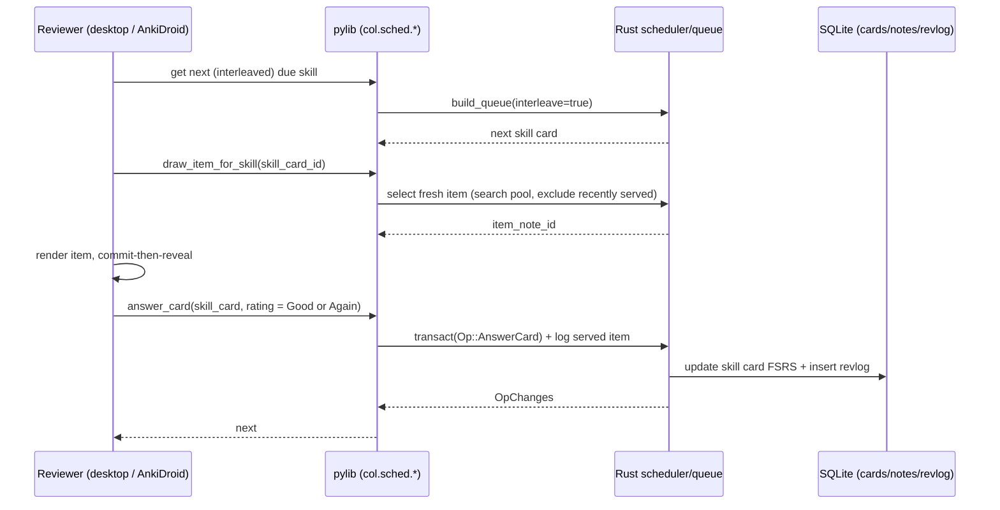
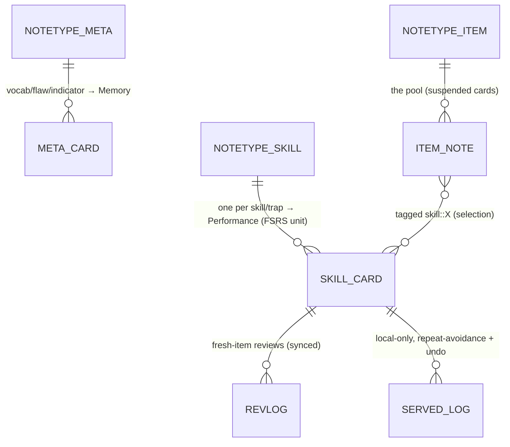

# Spec: Engine — skill-as-card interleaving & fresh-item draw

> The brownfield heart of Speedrun: the Rust change that makes the **skill/trap**
> the spaced unit, **draws a fresh item** on each due review, and **interleaves**
> across skills — built inside Anki's existing FSRS/answer/undo/sync paths, not a
> fork of them. Also defines the **mastery-query** RPC that feeds the dashboard.
> Companions: [`prd-speedrun.md`](./prd-speedrun.md), [`spec-measurement.md`](./spec-measurement.md),
> [`spec-sync-mobile.md`](./spec-sync-mobile.md), [`decisions.md`](./decisions.md)
> (D-SR3, D-SR4, D-SR5, D-SR6). Engine map:
> [`../../extra/architecture/ANKI_ARCHITECTURE.md`](../../extra/architecture/ANKI_ARCHITECTURE.md).
> **Status:** design locked, unbuilt.
>
> **Authority:** frozen initial design. For current truth read [`decisions.md`](./decisions.md);
> a later decision overrides this doc where they conflict.

## 1. The problem this fills

Plain Anki schedules a **card** — a fixed front/back. On a reasoning test that trains
"the answer to *this* item is C": recall of a specific item, which is **performance,
not learning**, and the wrong primitive (brainlift Insight 2). What a learner must
get better at is a **skill/trap** applied to *novel* items. So the engine must (a)
space the **skill**, (b) serve a **fresh** item each time it's due, and (c)
**interleave** skills so the learner practices *choosing* the right approach
(discriminative contrast — H.1). This has to happen in the **Rust engine** so it
ships to both desktop and the Android companion, and it must not break FSRS, undo,
or sync.

## 2. Goals & non-goals

**Goals**
- The FSRS-scheduled unit is a **skill/trap**, not a literal item (D2).
- On a due skill, the engine **selects a fresh, unseen item** from a pool and renders it (commit-then-reveal).
- Sessions **interleave** across due skills, behind a config flag (so the flag-off build is the ablation control — D-SR6).
- A **mastery-query** RPC returns per-skill aggregates fast on 50k cards (D-SR5).
- FSRS interval math, the answer path, undo, and sync are **reused unchanged** (D-SR4).

**Non-goals**
- No change to FSRS interval/stability formulas.
- **No schema change** and no new synced table in v1 (Performance derives from the synced skill revlog; per-card metadata rides `custom_data`/tags — §7).
- The engine never authors items (content comes from the pool — D-SR11).
- RC items and the full daily-reading module (phase-2 — D-SR12).

## 3. Grounding (research + product scan)

- **Why it works:** spacing + retrieval (Roediger & Karpicke), interleaving's discriminative-contrast benefit with large delayed gains (Rohrer & Taylor; ~76% in H.1), and "performance ≠ learning" (Bjork) all say: space the skill, vary the item, mix the types.
- **Caveat the design respects:** interleaving *feels* harder and lowers immediate performance — so the UI must not present that dip as failure, and the ablation must use **delayed** mixed-type accuracy as its metric (spec-measurement).

| Tool | Spaced unit | Fresh item each review? | Interleaves types? | Our wedge |
|---|---|---|---|---|
| Plain Anki | the literal card | no | only if the user hand-builds it | engine-level skill scheduling + fresh draw |
| 7Sage / LSAT Demon | problem sets / drills | n/a (curated sets) | partial (drill modes) | FSRS-driven, per-skill spacing + interleave-by-default |
| Generic SRS apps | the card | no | no | the skill is the unit |

## 4. The mechanic

Two depths, phased (D-SR3):

- **Level 1 (Wednesday checkpoint):** items stay FSRS cards, but the review surface is **commit-then-reveal** over a full LR item (stimulus + stem + 5 choices → commit → reveal key, per-choice "why wrong", trap), and the queue **interleaves** by skill tag. FSRS schedules the item card.
- **Level 2 (headline):** the **skill** is the FSRS-scheduled unit (a "skill card"); on due, the engine **draws a fresh item** of that skill from the pool and renders it. The review updates the **skill's** memory state.

The review loop (Level 2):



## 5. Algorithms & interfaces

### 5.1 Correctness → FSRS rating
Correctness is a deterministic key lookup. Map to Anki ratings so FSRS sees a valid stream:
`wrong → Again(1)`, `right → Good(3)`, optionally `right & fast & high-confidence → Easy(4)`. (Hard(2) reserved for a future "right but slow/low-confidence" signal.)

### 5.2 Fresh-item selection (the new Rust call)
For a due skill `S`: from the **item pool**, choose an item note tagged `skill::S` that is **not in the local served-item log** within window `W` (default: the last `min(pool_size_for_S − 1, N)` servings), preferring **difficulty-appropriate** items (warm-started difficulty — D4 / spec-ai). If all items for `S` were served within `W`, pick the **least-recently-served**.

```text
select_fresh_item(col, skill_card_id) -> ItemNoteId:
    S    = skill_of(skill_card_id)
    pool = search("note:LSAT_Item tag:skill::{S} -is:suspended_excluded")   # existing search infra
    recent = local_served_log.recent(S, window=W)
    candidates = pool - recent  (fallback: least-recently-served from pool)
    return pick_difficulty_appropriate(candidates, target_difficulty(skill_card_id))
```

### 5.3 Interleaving order (the queue change)
Driven by a **new additive `ReviewCardOrder` variant** in deck config (e.g.
`REVIEW_CARD_ORDER_INTERLEAVED_SKILLS`), the queue builder orders due skill cards to
**avoid consecutive same-type** items (round-robin across question-types, then
sub-skills), instead of blocking. Any existing (stock) order is the **ablation
control**. This is the idiomatic insertion point: `review_order` is already consumed
in `rslib/src/scheduler/queue/builder/{gathering,mod}.rs`, and adding an enum value
is backward-compatible (an un-updated client falls back to the default order, so
nothing breaks). Modelling it as an **enum** (not a bool) leaves room for future
orders such as points-at-stake.

### 5.4 Mastery query (dashboard feed — D-SR5)
One indexed SQL aggregate over skill cards + their revlog, grouped by skill: mastered-count (skills whose FSRS recall ≥ threshold), total, average recall. Target: p95 < 1s on 50k cards (PRD §7).

### 5.5 Protobuf + language bindings (the contract)

```protobuf
// proto/anki/scheduler.proto  (SchedulerService — collection-scoped)
message DrawItemForSkillRequest  { int64 skill_card_id = 1; }
message DrawItemForSkillResponse { int64 item_note_id = 1; }
rpc DrawItemForSkill(DrawItemForSkillRequest) returns (DrawItemForSkillResponse);
// interleaving is a NEW additive variant on the existing per-deck order enum
// (no new field, no schema change):
//   deck_config.proto: enum ReviewCardOrder { …; REVIEW_CARD_ORDER_INTERLEAVED_SKILLS = N; }
//   consumed where review_order already is: scheduler/queue/builder/{gathering,mod}.rs

// proto/anki/stats.proto  (StatsService — collection-scoped)
message SkillMasteryRequest  { int64 deck_id = 1; }
message SkillMastery         { string skill = 1; uint32 mastered = 2; uint32 total = 3; float avg_recall = 4; }
message SkillMasteryResponse { repeated SkillMastery skills = 1; }
rpc SkillMastery(SkillMasteryRequest) returns (SkillMasteryResponse);
```

```rust
// rslib/src/scheduler/service/mod.rs  (impl SchedulerService for Collection)
fn draw_item_for_skill(&mut self, input: DrawItemForSkillRequest) -> Result<DrawItemForSkillResponse>;
// rslib/src/scheduler/queue/builder/{gathering,mod}.rs — honor the new ReviewCardOrder variant
// rslib/src/stats/service.rs  (impl StatsService for Collection)
fn skill_mastery(&mut self, input: SkillMasteryRequest) -> Result<SkillMasteryResponse>;
```

```python
# pylib/anki/scheduler/v3.py  /  collection.py  — friendly wrappers
col.sched.draw_item_for_skill(skill_card_id: int) -> int
col.skill_mastery(deck_id: int) -> list[SkillMastery]
```

## 6. The key screen — commit-then-reveal review

The non-negotiable element: the learner **commits an answer before any reveal**. Only
after commit does the surface show the **key**, **per-choice "why wrong"**, and the
**trap tag** of any distractor chosen. This is the generation/prephrase step (K.1)
and the hook for trap-based misconception signals (D5).

## 7. Data model

Rides existing Anki tables; the only new persistent structure is a **local
(non-synced)** served-item log.



- **Notetype `LSAT Meta`** → normal flashcards (logic vocab, flaw defs, indicators) → drives **Memory**.
- **Notetype `LSAT Skill`** → one note per skill/trap → **one skill card** each → FSRS-scheduled unit → drives **Performance**. Skill identity stored in a field/tag (`skill::assumption`, `trap::sufficient-necessary`).
- **Notetype `LSAT Item`** → the **pool**: stimulus, stem, 5 choices, correct choice, per-choice why-wrong/trap, type, sub-skill, difficulty, source. Item cards are **suspended** (a pool, never directly studied); items are reached only by selection (§5.2). Tagged `skill::*`, `type::*`, `trap::*`.
- **Skill identity / per-card metadata:** stored on the skill card via the existing `Card.custom_data` JSON field and/or tags — **no schema change**.
- **Served-item record (local, best-effort, OUTSIDE the collection):** a small sidecar in the profile folder (or session memory) keyed by skill → recently-served items, for **repeat-avoidance** only. It is **not** a collection table, **not** synced, and **not** part of the undo stack.

**Why zero schema change (D-SR4):** **Performance derives entirely from the synced skill-card revlog** — every skill review *is* a fresh item by construction, so per-skill fresh-item accuracy = fraction-correct over `revlog` rows for that skill card. "Which specific item" is only needed locally (repeat-avoidance), so it lives in the best-effort sidecar. Skill metadata rides `custom_data`/tags. Nothing requires a new table or a schema-version bump → trivial upstream rebase, no impact on sync, downgrade, or `dbcheck`.

**Undo:** the skill review uses the normal `col.transact(Op::AnswerCard)` path, so **FSRS, revlog, and undo are fully intact** and the collection cannot corrupt. The sidecar is non-authoritative: if a review is undone, the worst case is an item *may* be re-eligible to draw — no corruption, no lost score data (scores recompute from the revlog).

## 8. UI surfaces

> **Render vs answer are decoupled, using existing RPCs — the reviewer is extended, not forked.** The drawn item is rendered with the existing `RenderUncommittedCard` / `RenderExistingCard` calls (`card_rendering.proto`), while the **skill card** is answered through the standard `AnswerCard` (`CardAnswer`). No change to the answer pipeline; only the *content source* the reviewer displays changes.

- **Desktop reviewer** (`qt/aqt/reviewer.py` + `ts/reviewer/`): render the *drawn* item (not the skill note's fields); commit-then-reveal; trap reveal.
- **AnkiDroid reviewer:** the same drawn-item render + commit-then-reveal (the engine call is shared; the UI is ported — spec-sync-mobile).
- **Dashboard** (`ts/routes/`): consumes `skill_mastery` + measurement outputs (spec-measurement).
- **Config:** a new `ReviewCardOrder` variant in deck options (drives the ablation; selecting a stock order = the control build).

## 9. Cold-start / the real risk

- **The pool must be tagged.** Selection needs items tagged by skill/type/trap. Question-type is stem-derivable (cheap); sub-skill/trap are AI-assisted-then-verified (spec-ai). Risk: thin pools per skill → repeats. Mitigation: a per-skill **minimum pool size** before that skill is schedulable; otherwise the skill is "uncovered" (feeds coverage/abstain).
- **Render-drawn-item integration** is the one place that diverges from stock Anki (reviewer renders selection output, not the card's own note). Mitigation: Level 1 ships first (item-as-card render) to de-risk the surface, then Level 2 swaps the content source.

## 10. Content / ops

- A **seed deck** (cited real items, D-SR11) ships pre-tagged so graders get a working pool. Upload-your-own items run through the tagging pipeline (spec-ai).
- Authoring contract: items are imported, never AI-authored (F.2).

## 11. Acceptance criteria

1. With the interleaved `ReviewCardOrder` selected, a session draws a **fresh, unseen** item per due skill and **does not** place two same-type items consecutively; with a stock order selected, order matches Anki (the ablation control).
2. Answering a skill review updates the **skill card's** FSRS state + inserts a `revlog` row via the normal path; **undo** restores card, revlog, and scheduler state atomically with **no new collection table or schema change** (test: review → undo → collection integrity intact; the served-item sidecar is best-effort and non-authoritative).
3. `draw_item_for_skill` returns an item not served within window `W` when one exists; falls back to least-recently-served otherwise (unit-tested).
4. `skill_mastery` returns correct per-skill aggregates and meets p95 < 1s on the 50k-card deck (benchmarked).
5. The change is callable from **Python** and present in the **AnkiDroid** build.
6. **Tests:** ≥3 Rust unit tests (selection, interleave-ordering, mastery aggregate) + 1 Python end-to-end test; an undo/no-corruption test; a one-pager "why this is in Rust"; a touched-upstream-files + merge-risk list.

## 12. Decisions & alternatives

See [`decisions.md`](./decisions.md): **D-SR3** (Level 2 skill-as-card; Level 1 = Wednesday; points-at-stake deferred), **D-SR4** (reuse FSRS/undo/sync; no synced table; Performance from skill revlog), **D-SR5** (mastery query), **D-SR6** (interleaving = the ablated feature, same toggle).

## 13. Out of scope (now), tracked

- Synced per-item-outcome table → phase-2 if per-device recomputation proves insufficient (D-SR4).
- Points-at-stake ordering → phase-2 (D-SR3).
- RC item selection → phase-2 (D-SR12).

## 14. Product phasing

- **v1 (this week):** Level 1 (Wed) → Level 2 + mastery query; LR only; interleaving toggle.
- **Phase-2:** RC selection, points-at-stake mode, optional synced outcome table.

---

<sub>Created with the `iris-plan` skill by Iris Cai · maintained with `iris-log`.</sub>
